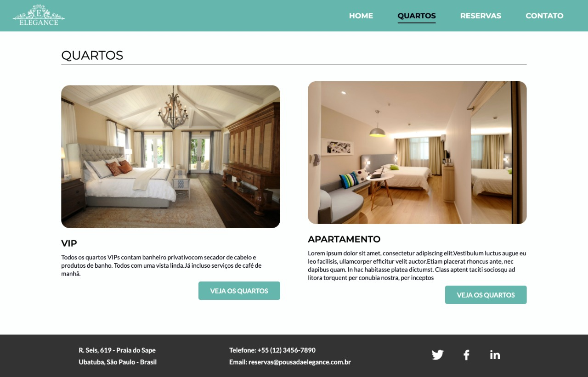
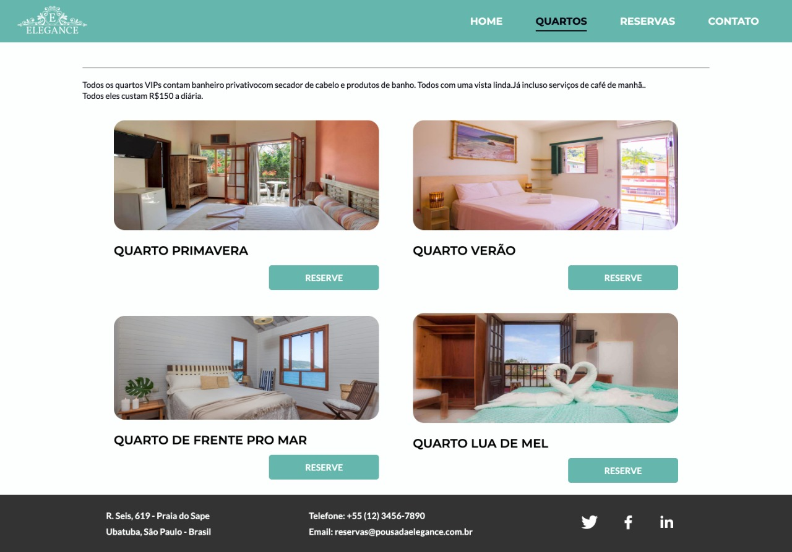

# Pousada Elegante

Projeto de pousada para Digital Experience Platform 

## Instalação

Rode os comandos abaixo, nesta ordem, para poder utilizar o projeto corretamente:


```bash
npm install

npm run dev
```


Agora, crie um banco de dados e configure ele no arquivo knexfile.js, na raiz do projeto. Ele deverá ficar dessa forma:

```js
development: {
   client: 'mysql',
   connection: {
     port: "3306",
     host: "127.0.0.1",
     database: "pousada",
     user: "root",
     password: "123",
   }
},
```

Para criar as tabelas, rode o comando abaixo.


```bash
npm run migrate
```

Por último, para preencher os dados, rode o comando:
```bash
npm run db:seed

```

## Uso

### Tela principal - Home

Ao entrar no site o usuário verá a tela a principal da Pousada Elegance, nela são exibidas informações básicas como localização,
benefícios e uma breve descrição. Também são exibidas imagens para que as pessoas vejam e conheçam melhor a pousada.

### Tela de quartos

Nesta tela são exibidos os dois tipos de quartos da pousada: o vip e o apartamento. É uma página simples com uma breve explicação
sobre cada quarto e seus benefícios e características individuais. Ao clicar nos botões o usuário será direcionado para outra página
que será explicada a seguir.

### Tela de quartos disponíveis

Nesta tela são exibidos os quartos disponíveis da categoria escolhida pelo usuário na tela anterior (vip ou apartamento). Aqui é onde
o cliente pode escolher qual acomodação ele deseja reservar.

## Integrantes
- Cyntia Sayuri de Almeida - 
- Fernando de Oliveira Laurino - 83825
- Luis Guilherme Bíspo - rm80389
- Michael Andrews Contrera Liu - rm82443
- Vanessa Amaral Marques - rm83690
